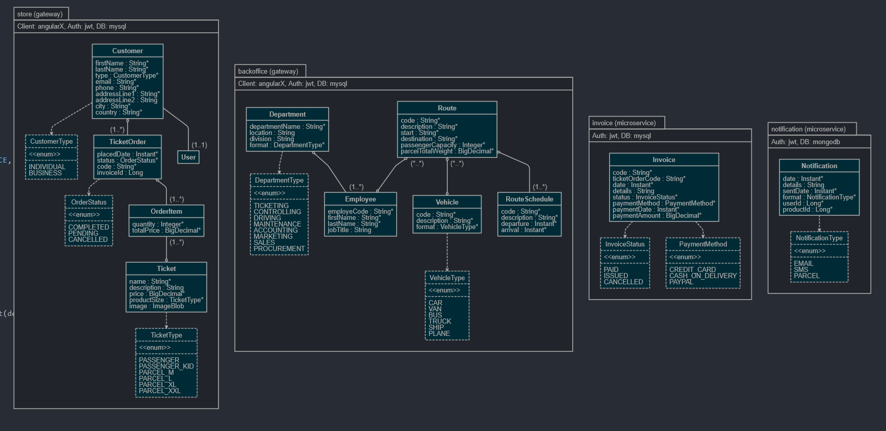
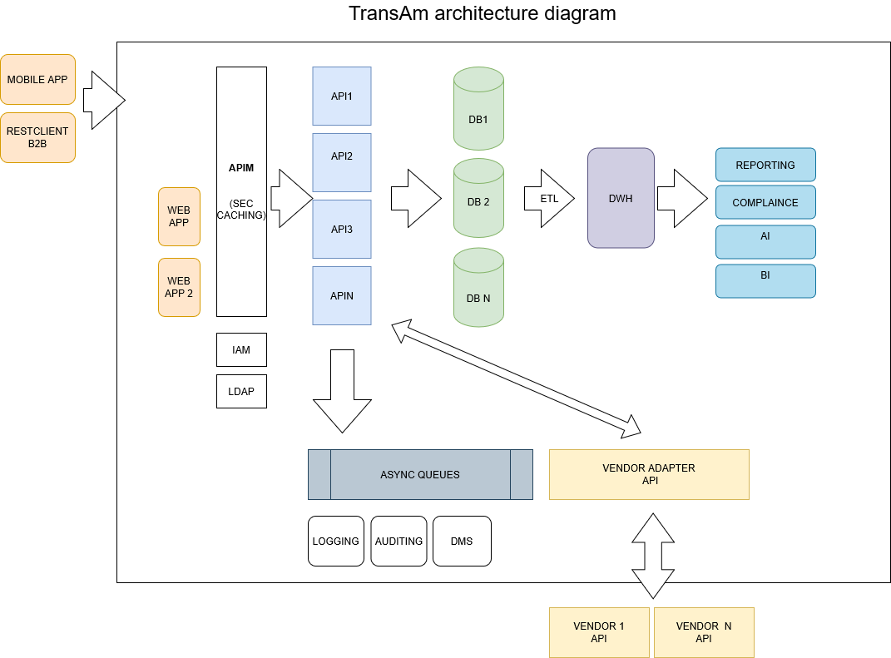

# TransAM Company prototype app/architecture

Arhitecture of this POC solution is shown below:



There are four apps/microservices :


| Application | URL | Description |
| --- | --- | --- |
transambackoffice |     http://localhost:8080  |  internal back office app for managing departments , employees  ....
transamstore    |       http://localhost:8080  |  external store for individual/business customers
transaminvoice   |      http://localhost:8081  |  internal app for handling invoices
transamnotification  |  http://localhost:8082  |  internal endpoint for sending notifications

## Starting and using apps

Go to wanted app folder and type:

```shell
./mvnw
```

Then open url in the browser. 
Type "admin", "admin" for username and password.
You can browse for db entites or test endpoints with adminstration menu


### Future

We want to build upon this POC towards architecture shown in the image:



 